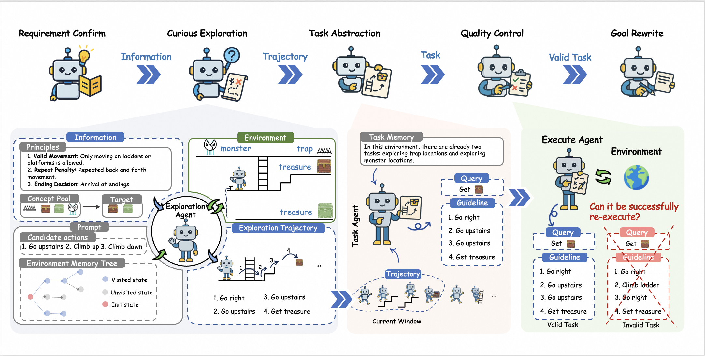
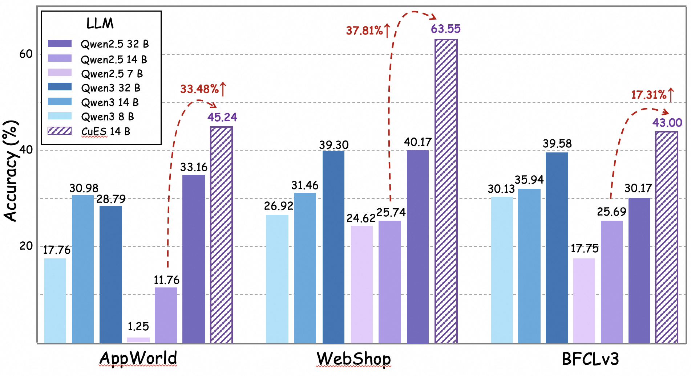

<p align="center">
  Official codebase for <b>“CuES: Bottom-Up Exploration and Top-Down Guidance for Agentic Data Synthesis” (ICLR 2026 under review)</b>.
</p>

<p align="center">
  
</p>

---

## 🔍 Overview

CuES is a **curiosity-driven, environment-grounded framework** for synthesizing high-quality agentic data **without predefined seed queries**.

Conceptually, CuES unfolds in **five coordinated stages** (as in the paper):

1. **Requirement Confirmation** – derive guiding principles and a concept pool from environment description, optional user requirement, and (optional) seed queries.  
2. **Curious Exploration** – explore the environment bottom-up using an Explorer Agent guided by a memory tree and concept pool.  
3. **Task Abstraction** – lift consecutive low-level interaction triplets into executable natural-language tasks with guidelines.  
4. **Quality Control** – re-execute and judge each candidate task to ensure executability and path faithfulness.  
5. **Query Rewrite** – progressively expose guideline hints in the query text to control difficulty and diversify task formulations.

This repository implements a **lightweight three-stage pipeline** that closely follows the above design:

- **Stage 1: Triplet Generation (Curious Exploration)**  
  Curiosity-guided rollout in the environment, storing triplets `(state, action, observation)` and environment memory.
- **Stage 2: Task Abstraction**  
  Derive natural-language tasks (queries) and guidelines from exploration trajectories.
- **Stage 3: Trajectory Generation (Quality-Controlled Execution)**  
  Execute synthesized tasks with an agent, record complete trajectories, and attach success/failure metadata.
- **Optional: Query Rewrite，Requirement Confirm**  

CuES is evaluated on **AppWorld**, **WebShop**, and **BFCL v3 Multi-Turn Base**, and the synthesized data is shown in the paper to match or surpass original datasets in terms of **diversity, executability, and downstream RL performance**.

<p align="center">
  
</p>

---

## ✨ Features

- **Environment-grounded synthesis**  
  Tasks originate from executed trajectories, ensuring **feasibility by construction**.
- **Curiosity + top-down guidance**  
  Concept pool and principles guide exploration toward salient regions without prescribing exact tasks.
- **Environment memory tree**  
  Encourages novel actions and reduces redundant loops during exploration.
- **Query-free or limited-query setting**  
  Operates without manual seed tasks; optional seeds only refine the concept pool.
- **Multi-environment support**  
  Designed for AppWorld, WebShop, and BFCL v3 Multi-Turn Base via EnvService.
- **Deterministic JSON schemas per stage**  
  Stable data interfaces across Stage 1/2/3 and Query Rewrite.
- **Config-driven pipeline**  
  All behavior controlled through `config/config.yaml`.

---

## ⚙️ Requirements

- Python **3.10+**
- Access to **Aliyun DashScope API**
- (Optional) **EnvService** if using external interactive environments (AppWorld / BFCL / WebShop)

---

## 📥 Installation

## Quickstart

1) Requirements
- Python 3.10+
- Access to Aliyun DashScope API
- EnvService if using external simulated environments (AppWorld/BFCL/WebShop)

2) Installation

```python
# Create and activate a virtual environment
# Install dependencies (adapt to your environment)
bash ./env_service/environments/appworld/setup.sh
# Export your DashScope key:
export DASHSCOPE_API_KEY=... (or set in config.yaml)
conda activate appworld
bash ./env_service/launch_script/appworld.sh
python ./env_service/test_script/test_appworld.py
```

3) Configuration
See `config/config.yaml` for full options. Key sections:
- api: DashScope model, temperature, max tokens
- environment: type and EnvService endpoint
- stage1/stage2/stage3: knobs per stage
- threading: worker pool settings
- logging: level and file path
- rewrite: Query Rewrite settings

4) Run
```python
# All stages:
python main.py --stage all --config config/config.yaml
# Stage 1:
python main.py --stage stage1
# Stage 2:
python main.py --stage stage2 --input-file ./data/triplets/*.jsonl (latest auto-selected if omitted)
# Stage 3:
python main.py --stage stage3 --input-file ./data/tasks/*.jsonl (latest auto-selected if omitted)
# Enable rewrite after stage 3: add --rewrite (alias: --query-rewrite)
# Enable requirement confirm before stage 1: add --extract
```

Outputs are written to `./data/`:
- data/triplets/*.jsonl
- data/tasks/*.jsonl
- data/trajectories/trajectory_*.json
- data/trajectories/failed_tasks/*.json
- data/rewrites/trajectories/trajectory_*_rw*.json

## Run with EnvService (AppWorld)

Use the bundled EnvService scripts to bring up the AppWorld environment, then run the pipeline:

1) Prepare environment with conda
- Ensure conda is installed and available in your shell:
  - source $(conda info --base)/etc/profile.d/conda.sh

2) Install AppWorld environment via setup script
- cd env_service/environments/appworld
- bash setup.sh

3) Launch EnvService for AppWorld (in a separate terminal)
- cd env_service/launch_script
- bash appworld.sh

4) Configure Client (optional)
- In `config/config.yaml`, set:
  - environment.type: appworld
  - environment.envservice.server_url: http://127.0.0.1:8080

5) Start synthesis
- From the repo root (CuES/):
  - python main.py --stage all --config config/config.yaml

Notes
- You can override `APPWORLD_ROOT` before launching to point to an existing AppWorld data directory.
- If EnvService runs on another host/port, update `server_url` accordingly.

## CLI
- --config: path to config file (default: config/config.yaml)
- --stage: all | stage1 | stage2 | stage3
- --session-name: label for the run
- --input-file: input for stage2/stage3
- --verbose: verbose logging
- --requirement: exploration requirement for stage1
- --extract: extract concept set from env (optional)
- --rewrite | --query-rewrite: run Query Rewrite after Stage 3

## main() flow
1. Load config and validate API key
2. If AppWorld is selected, probe EnvService
3. Build pipeline and run selected stage(s)
4. Save outputs and stats
5. If rewrite is enabled, run Query Rewrite over Stage 3 outputs

## Query Rewrite
- Purpose: produce multiple semantically equivalent variants for each task query while keeping the exact Stage 3 JSON structure.
- Input: a directory of `trajectory_*.json` or a single file.
- Output: per-file JSONs under `data/rewrites/trajectories/`, named `trajectory_<task_id>_rw<i>.json`.
- Method: summarize `messages` context and prompt the LLM to rewrite the `query` into up to K variants.
- Config:
  - rewrite.batch_size: default 10
  - rewrite.num_variants: default 3
- CLI: pass --rewrite or --query-rewrite with --stage all (after stage 3) or run independently by calling the pipeline API.

## Development notes
- Code layout:
  - agents/: LLM action planner and evaluator
  - core/: API client, memory manager, pipeline
  - data/: pydantic-like models and storage helpers
  - envs/: EnvService managers (AppWorld, BFCL, WebShop)
  - environment/: legacy base abstractions
  - prompts/: all prompt builders and parsers
  - stages/: Stage 1/2/3 implementations
  - utils/: logger and config utilities
- Trajectories store both metadata and `messages` for downstream use.
- Query Rewrite preserves all keys and only changes `query`.

## Troubleshooting
- EnvService import errors: ensure EnvService is available in PYTHONPATH or run from the repo root where EnvService exists.
- Missing API key: set `api.dashscope_api_key` in `config.yaml` or environment variable.
- Empty outputs: check logs in `./logs/agentflow.log` and lower thresholds.
